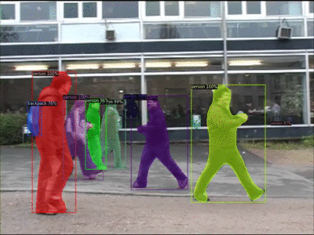
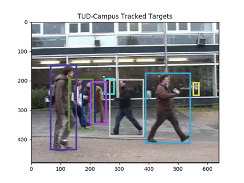

# MOT Challenge 2015
Colab Notebook was used to perform the tests
[](https://colab.research.google.com/drive/1hhtoMwFxpOGXiXtIjEBeST9rQ6BdF5Gm?usp=sharing)

As part of my professional residencies at the [CIMAT](https://www.cimat.mx/), this research and testing was carried out to learn more about MOT algorithms and later use the information to use them in RGB-D images.

- Detections were obtained using [Detectron2](https://github.com/facebookresearch/detectron2)
- The algorithms for multiple object tracking was used are [SORT](https://github.com/abewley/sort) and [Deep SORT](https://github.com/nwojke/deep_sort)
- The MOT metrics were obtained by [py-motmetrics](https://github.com/cheind/py-motmetrics)

# MOT Metrics with Detectron2 detections
- SORT (TUD-Campus Sequence)
  ```sh
              IDF1   IDP   IDR  Rcll  Prcn GT MT PT ML  FP FN IDs  FM  MOTA  MOTP IDt IDa IDm
  TUD-Campus 53.4% 48.3% 59.6% 83.6% 67.7%  8  5  3  0 143 59   8  10 41.5% 0.255   2   6   0
  OVERALL    53.4% 48.3% 59.6% 83.6% 67.7%  8  5  3  0 143 59   8  10 41.5% 0.255   2   6   0
  ```
- Deep SORT (TUD-Campus Sequence)
  ```sh
              IDF1   IDP   IDR  Rcll  Prcn GT MT PT ML FP FN IDs  FM  MOTA  MOTP IDt IDa IDm
  TUD-Campus 55.8% 56.4% 55.2% 76.6% 78.3%  8  3  5  0 76 84   8  10 53.2% 0.235   2   7   1
  OVERALL    55.8% 56.4% 55.2% 76.6% 78.3%  8  3  5  0 76 84   8  10 53.2% 0.235   2   7   1
  ```

# Detectron2 video detections


# SORT with Detectron2 detections - video
 

# Deep SORT with Detectron2 detections - video
 
